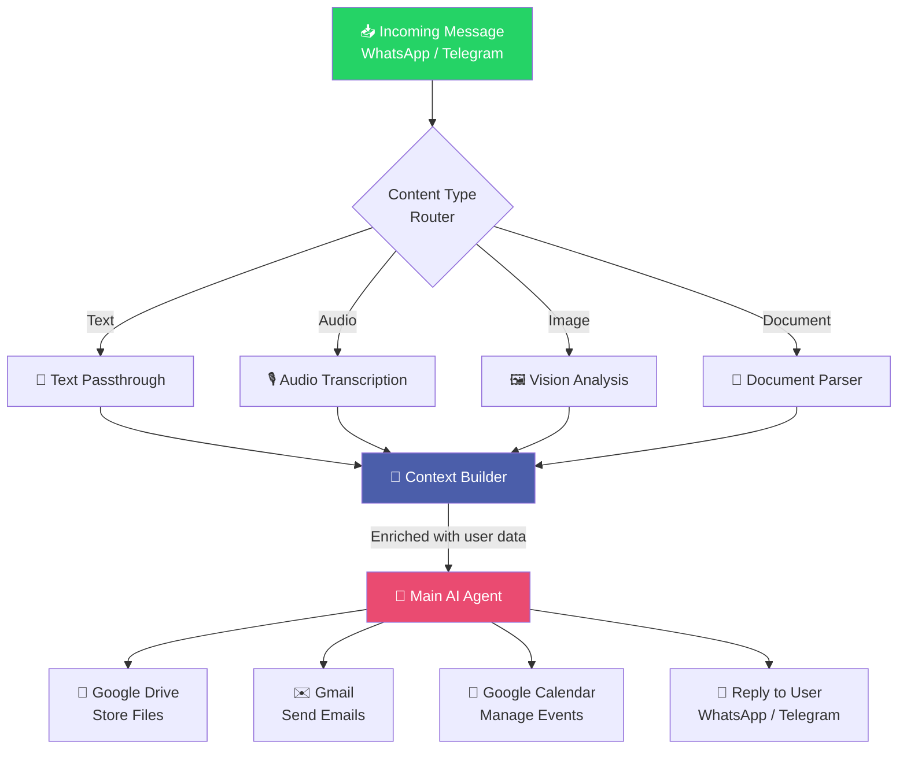

<div align="center">

# 🤖 FlowAgent

### AI-Powered Workflow Automation Built with n8n

[](https://n8n.io)
[](https://www.whatsapp.com)
[](https://telegram.org)
[](https://drive.google.com)
[](https://gmail.com)

*A modular, visual AI agent system that unifies messaging, media intelligence, and productivity tools — no backend code required.*

[Overview](#-overview) • [Architecture](#-architecture) • [Installation](#-installation) • [Configuration](#-configuration) • [Usage](#-usage) • [Extending](#-extending-flowagent)

</div>

---

## 📌 Overview

**FlowAgent** is a visual, scalable automation workflow built entirely in **n8n**, inspired by the OpenClow concept. It acts as a central AI agent that receives messages from multiple platforms, understands different types of media, enriches them with stored context, and executes intelligent actions across connected services.

Instead of writing custom backend infrastructure, FlowAgent leverages n8n's visual node-based editor to orchestrate the entire pipeline — from message ingestion to AI reasoning to action execution.

### ✨ Key Capabilities

| Capability | Description |
|---|---|
| 🔀 **Multi-source ingestion** | Receives messages from WhatsApp and Telegram |
| 🧭 **Content-type routing** | Automatically detects and routes text, audio, images, and documents |
| 🎙️ **Audio transcription** | Converts voice messages into text |
| 🖼️ **Vision analysis** | Analyzes images using vision-capable AI models |
| 📄 **Document parsing** | Extracts structured insights from uploaded files |
| 🧠 **Context enrichment** | Builds personalized context from stored user data |
| 🤖 **Central AI agent** | Reasons over all inputs and decides the next action |
| 🔗 **External integrations** | Connects to Google Drive, Gmail, and Google Calendar |

---

## 🏗️ Architecture

FlowAgent follows a **linear-then-branching** pipeline: inputs are normalized, routed by type, processed, enriched with context, and finally handed to a single decision-making agent.



### How it works, step by step

1. **Ingestion** — WhatsApp/Telegram triggers listen for incoming messages.
2. **Routing** — A switch/router node inspects the message and sends it down the correct path based on its type.
3. **Processing** — Each content type is normalized into text or structured data:
   - Audio → transcription node
   - Image → vision model node
   - Document → parsing node
4. **Context Building** — A dedicated node fetches stored user data (preferences, history, profile) and merges it with the processed input.
5. **AI Agent** — The enriched payload is passed to the core AI agent, which reasons about intent and selects the right tool(s) to call.
6. **Action Execution** — The agent triggers one or more integrations (Drive, Gmail, Calendar) or replies directly to the user.

---

## ⚙️ Installation

### Prerequisites

- [Node.js](https://nodejs.org) (v18+) or [Docker](https://www.docker.com)
- An [n8n](https://n8n.io) instance (self-hosted or cloud)
- API credentials for WhatsApp, Telegram, your AI provider, and Google services

### Steps

**1. Clone the repository**
```bash
git clone https://github.com/<your-username>/flowagent.git
cd flowagent
```

**2. Install and run n8n**

Using npm:
```bash
npm install n8n -g
n8n start
```

Using Docker:
```bash
docker run -it --rm \
  --name flowagent-n8n \
  -p 5678:5678 \
  -v ~/.n8n:/home/node/.n8n \
  n8nio/n8n
```

**3. Import the workflow**

- Open n8n at `http://localhost:5678`
- Go to **Workflows → Import from File**
- Select the `flowagent.json` file from this repository

**4. Configure credentials** *(see [Configuration](#-configuration) below)*

**5. Activate the workflow**

Toggle the workflow to **Active** in the top-right corner of the n8n editor.

---

## 🔐 Configuration

Before activating FlowAgent, set up credentials for each connected service inside n8n's **Credentials** manager.

| Service | Credential Type | Used For |
|---|---|---|
| WhatsApp Business API | OAuth / API Key | Receiving and sending messages |
| Telegram Bot API | Bot Token | Receiving and sending messages |
| AI Provider (LLM + Vision) | API Key | Transcription, vision analysis, agent reasoning |
| Google Drive | OAuth2 | Storing files |
| Gmail | OAuth2 | Sending emails |
| Google Calendar | OAuth2 | Creating/managing events |

### Environment variables

Create a `.env` file (or configure equivalent n8n environment variables):

```env
WHATSAPP_API_TOKEN=your_whatsapp_token
TELEGRAM_BOT_TOKEN=your_telegram_bot_token
AI_API_KEY=your_ai_provider_key
GOOGLE_CLIENT_ID=your_google_client_id
GOOGLE_CLIENT_SECRET=your_google_client_secret
```

> ⚠️ Never commit real credentials to version control. Use n8n's built-in credential store or a secrets manager in production.

---

## 🚀 Usage

Once the workflow is **active**, FlowAgent runs autonomously:

1. A user sends a message via **WhatsApp** or **Telegram** — text, voice note, image, or document.
2. FlowAgent detects the content type and routes it automatically:
   - 🎙️ Voice → transcribed to text
   - 🖼️ Image → described/analyzed via vision model
   - 📄 Document → parsed into structured content
3. The **Context Builder** enriches the request with the user's stored data.
4. The **AI Agent** decides what to do — reply, save a file, send an email, or schedule an event.
5. The result is delivered back to the user or executed via the relevant Google service.

### Example flow

> User sends a voice note asking to "schedule a meeting with the marketing team tomorrow at 10am and email them the agenda."

FlowAgent will:
- Transcribe the voice note
- Understand the intent via the AI agent
- Create the event in **Google Calendar**
- Draft and send the agenda via **Gmail**
- Confirm back to the user on WhatsApp/Telegram

---

## 🧩 Extending FlowAgent

FlowAgent is designed to be modular. You can extend it by:

- **Adding new input channels** (e.g., Slack, Instagram DMs, email)
- **Adding new processing nodes** (e.g., OCR, translation, sentiment analysis)
- **Connecting new tools** to the AI agent (e.g., Notion, Trello, CRM APIs)
- **Customizing the agent's logic** — adjust its system prompt, available tools, or decision rules
- **Building use-case variants** — customer support bot, personal productivity assistant, sales automation, etc.

Because everything lives in n8n's visual canvas, most extensions require no custom backend code — just new or reconfigured nodes.

---

## 📁 Project Structure

```
flowagent/
├── flowagent.json          # Main n8n workflow (importable)
├── .env.example             # Environment variable template
├── docs/
│   └── architecture.png     # Architecture diagram (optional export)
└── README.md
```

---

## 🤝 Contributing

Contributions are welcome. If you'd like to add a new integration, processing node, or use case:

1. Fork the repository
2. Create a feature branch (`git checkout -b feature/my-feature`)
3. Commit your changes
4. Open a pull request

---

## 📄 License

This project is released under the [MIT License](LICENSE).

---

<div align="center">

Built with ELMGHARI ABDELHAMID using **n8n** — the visual workflow automation platform.

</div>
